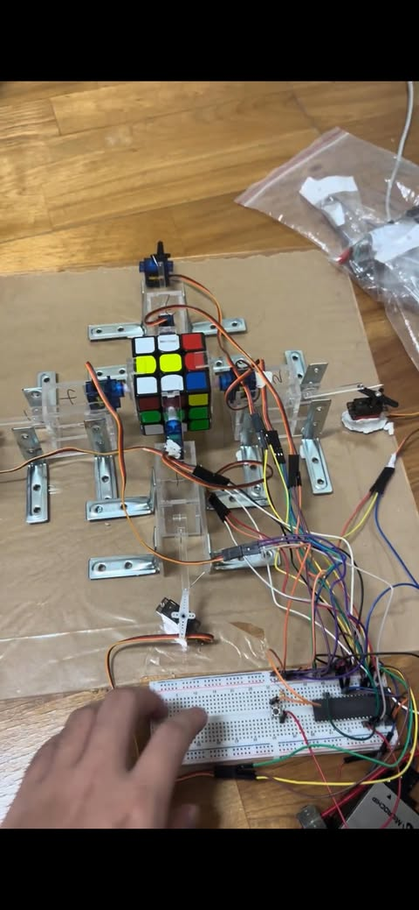

# Intelligent Rubik's Cube Solver
This project presents an Intelligent Rubik's Cube Solver with a Python-based GUI for inputting cube states and uses the kociemba library to generate solution steps, which are then compiled into C code to control motors via a PIC18F microcontroller. Integrating mechanical assembly, laser-cut acrylic parts, and servo motor control, the system offers a hands-free solution for solving cubes and serves as an educational showcase of smart manufacturing and embedded systems.

